# Overview


This project is a template implementation of a devops CI/CD pipeline.  Upon code checkin, the project is linted, built and API tested.  If all these are successful, a service is deployed to a live server.  The target server could be in a dev, staging or production environment.

A sample flask service is provided.  This is a placeholder; the intention is to replace it with your own microservice.

The code is stored in a GitHub repository.  Azure Pipelines is used to build the project, which hooks into Azure App Services for deployment.

## Project Plan

This project was done in the context of agile methods.  A CI/CD pipeline can be used with any project methodology, but agile relies on rapid, if not continuous, delivery to market (hence the name).

To start things off, a quick look ahead at the course contents and project requirements was done.  From this, milestones and time estimates were made, and a rough plan in [Google docs](https://docs.google.com/spreadsheets/d/1MzGub0FddyPmF_IfvbL_cvbgdg01KYJ0uMRwSX69rHM/edit#gid=1348135932) was created.

A [Trello](https://trello.com/b/ySyI22ET/ci-cd-pipeline) board was created and tickets corresponding to the milestones were made.  The tickets are more detailed and (hopefully) broken down into ~4-hour jobs.  Of course these are just estimates, the actual time required can vary greatly.

(**Note to grader:** the Trello board was left in an incomplete state.  It's not much to look at if everything's in the _Done_ column...)


As mentioned in lecture, the management process overhead should be right-sized for the project.  But in this case, part of the assignment is the application of agile methods, so it's a bit process-heavy, by design.

## Instructions

The CI/CD pipeline involves multiple accounts working in concert.  Some manual setup is required.

Prerequisites:
- [GitHub](https://github.com/) account
- [Azure](https://portal.azure.com/) account
- [Azure DevOps](https://dev.azure.com/) account
- basic familiarity with all 3 environments

This CI/CD pipeline exists entirely in GitHub and Azure, so there is no need to clone the repository locally in the setup process.


The process flow is as follows:
1. A developer commits changes and pushes them to GitHub.  This can be from any enlistment; however, for consistency, these instuctions will use the Azure Cloud Shell for initial testing.
2. The push event triggers an Azure Pipeline build.  Optionally, it may also trigger a second build using GitHub actions.
3. If the build succeeds, the build product is deployed to Azure and an App Service is started.  At this point you should be able to invoke the service and test your changes.

As shown in the diagram, the build performed by the GitHub Action is redundant.  In practice the builds could be triggered by different events.  For example, the GitHub Action might run on every checkin, and the Azure Pipeline could be scheduled to deploy a nightly update to production.

(This was not addressed in lecture.  The deployment strategy will vary greatly by project.  For example, it might be best to avoid updating a website during peak usage.  Even though deployment might not literally be _continuous_, it will still be referred to as a CI/CD pipeline.)

1. To interact with GitHub from Azure, generate an SSH key and add it to your GitHub profile.
    1. Open the Cloud Shell in Azure.
    2. Create an SSH key with `ssh-keygen -t rsa`
    3. Show the key with `cat ~/.ssh/id_rsa.pub`
    4. Highlight the SSH key and copy it.
    5. In GitHub, click on you profile, then click Settings | SSH and GPG Keys.
    6. Click New SSH Key
    7. Paste in the SSH key and give it a title.
    8. Click Add SSH Key

**Sanity check:** You should now see the new SSH key added to the list.


2. Get the code.
    1. In GitHub, [fork](https://docs.github.com/en/free-pro-team@latest/github/getting-started-with-github/fork-a-repo) [this repository.](https://github.com/PaulNWms/udacity-cicd-pipeline)
    2. Click Code | SSH, then click the clipboard icon to copy your repo's SSH path.
    3. In the Azure Cloud Shell, clone your new repository with `git clone`  
    

**Sanity check:** The code should download to a new folder without issues.

3. Set up a python virtual environment and activate it.  In this this example it's named 'cicd'.  


**Sanity check:** You should see the prompt change to reflect the virtual environment.

4. Build the project with `make all`.
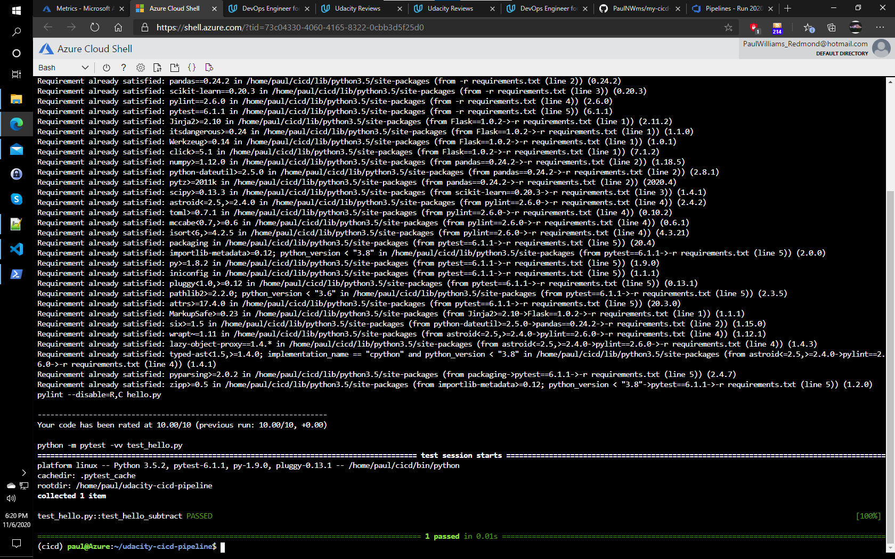

**Sanity check:** The project should build without errors.

5. Run the microservice 'locally' (i.e. in the Cloud Shell).

Open a second console and run `curl localhost:5000`.  The microservice should respond with some HTML.


**Sanity check:** Each time you run the `curl` command it should add another HTTP GET line to the output on the _main_ console, similar to the last line above.  

6. Deploy, run and test the microservice in Azure App Services.  
This will make it available over the internet.  Equally important, it will implicitly create a VM.  In a moment, this will become the target for the CD pipeline to deploy its content _to_.
    1. Back in the main Cloud Shell, `export FLASK_APP=app.py`, so flask knows what to run in the Azure App.
    2. Pick a name for your microservice.  This name will appear in the publicly available URL.
    3. Replace `<yourappname>` in `make_predict_azure_app.sh`
    4. Create the resource group and VM, upload the contents of the current directory and launch flask with `az webapp up`.  You will use the name for this command as well.  (here it's `udacity-flask-ml-service`)
    
    

**Sanity check(list):**  `az webapp up` did quite a few things behind the scenes, so there are a few things to check for
- The output contains the message `You can launch the app at ...`
- The output prints out JSON, and it contains the string `"sku": "FREE"`
- Hitting the website with `curl` produces the same HTML output it did in the previous step, when the service was run 'locally'.
- Running `./make_predict_azure_app.sh` responds with JSON.

7. In the second command window, tail the logs of the running Azure App with `azure webapp log tail`, e.g.

```bash
az webapp log tail --resource-group PaulWilliams_Redmond_rg_Linux_centralus -n udacity-flask-ml-service
```
**Sanity check:** Back in the main Cloud Shell, run `./make_predict_azure_app.sh`.  The request should be logged in the second Cloud Shell.
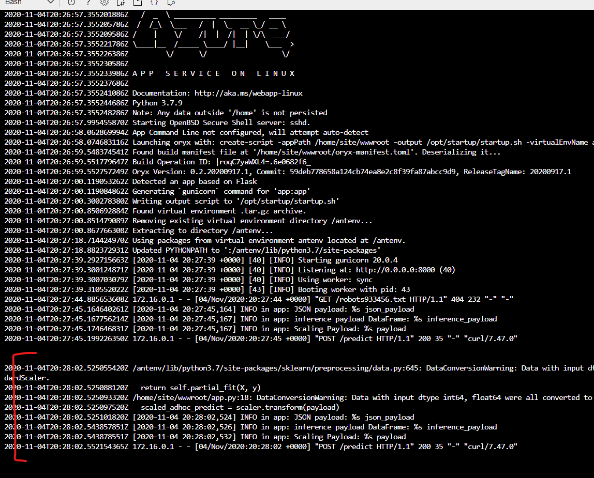


8. **OPTIONAL** Set up GitHub Actions to build the project whenever changes are pushed to GitHub.  
This part is optional, but it's straightforward and can be disabled later.
    1. In GitHub, navigate to your project and click Actions.
    2. The project already has a GitHub Actions YAML file, so you should see this message:
    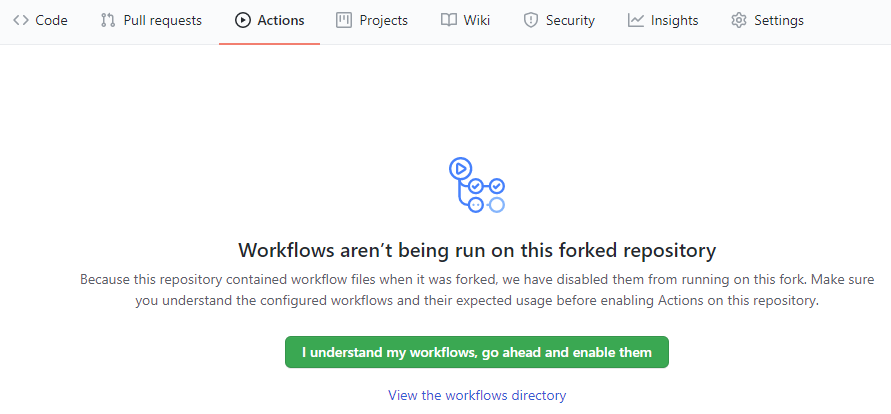
    Click the green button.  
    (apparently 'workflows' = GitHub Actions)  
    **Sanity check:** In the Azure Cloud Shell, edit this README.md, adding a few blank lines at the end.  Commit the changes in Git and push the repository to GitHub.  Now go back to GitHub.  The GitHub Action should have started, and it should succeed.  
    

Note that you can disable the workflow at any time if you want to.


9. Set up Azure Pipelines to build and deploy the project whenever changes are pushed to GitHub.  
This last step has several moving parts and specific details are subject to change.  If troubleshooting is necessary, please refer to the [official Azure Pipelines documents.](https://docs.microsoft.com/en-us/azure/devops/pipelines/repos/github?view=azure-devops&tabs=yaml)
    1. In GitHub, in the root folder of your repository there is a file called `azure-pipelines.yml`.  Delete this file and commit the changes.  (**Note to grader:** This file only exists for your benefit.)  When we run the wizard below, it will create a new `azure-pipelines.yml`, with the variables properly set for your configuration.
    2. Open up [Azure DevOps](https://dev.azure.com/).  If you don't have an existing organization you can use, you will need to set one up using [these instructions](https://docs.microsoft.com/en-us/azure/devops/user-guide/sign-up-invite-teammates?view=azure-devops).  
    (**Note to grader:** The remaining steps follow very closely the Microsoft documents on [pipeline setup](https://docs.microsoft.com/en-us/azure/devops/pipelines/ecosystems/python-webapp?view=azure-devops#create-an-azure-devops-project-and-connect-to-azure).  I was planning on referring the reader to this doc, but as of this writing the Microsoft help page is out of sync with the Azure Pipelines UI.  A few screens were borrowed from the Udacity instructions.)
    3. Create a new project.
    
    4. From the new project page, select Project settings from the left navigation.
    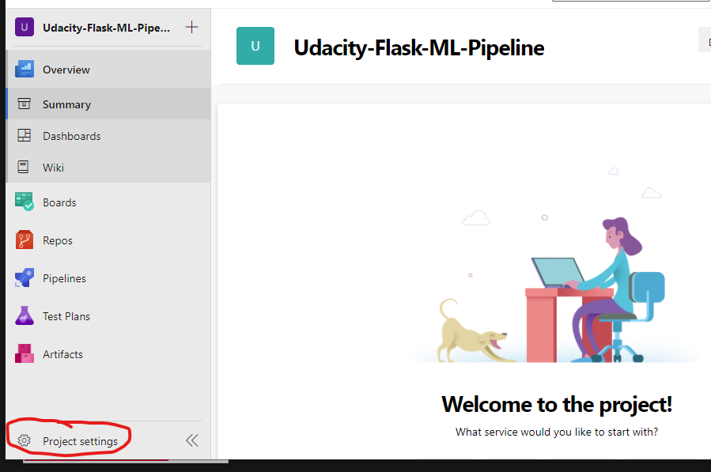
    5. On the Project Settings page, select Pipelines > Service connections, then select New service connection, and then select Azure Resource Manager from the dropdown.
    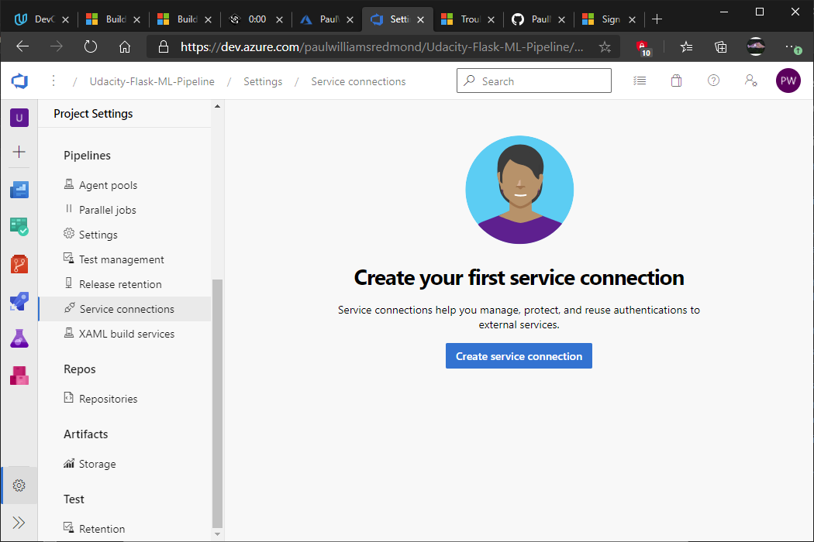
    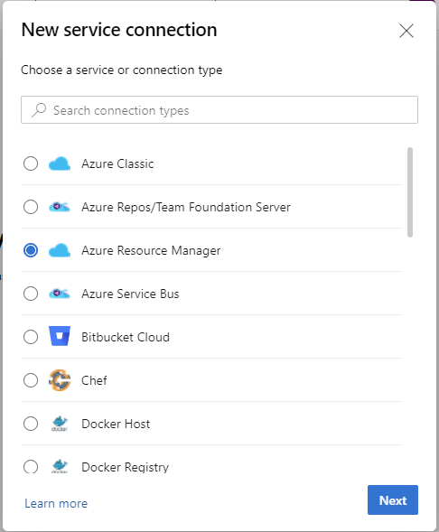
    
    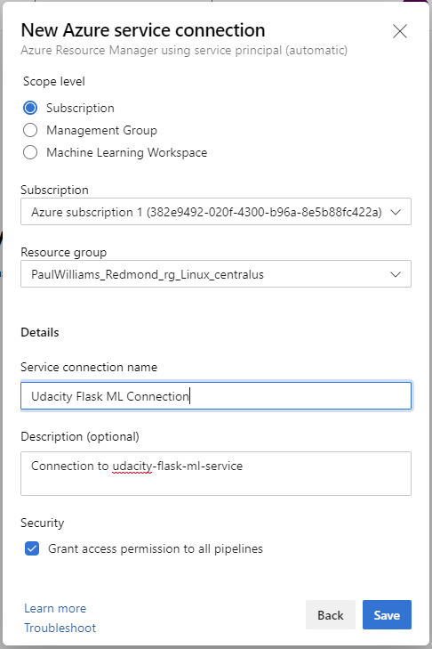
    6. Select Pipeline and create a new one.
    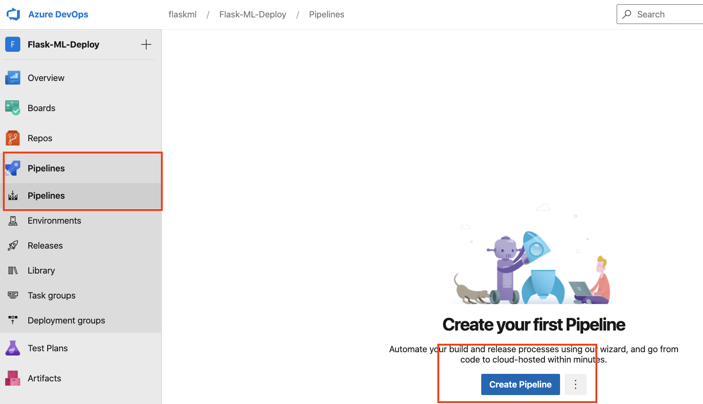  
    Create the GitHub Integration
      
    Select your the repository to watch
    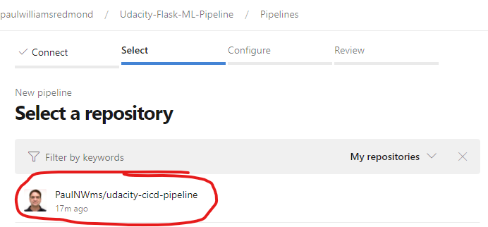  
    Select **Python to Linux Web App on Azure**.
      
    Enter the microservice name.
      
    Notice that the YAML is **wrong** at this stage.  Don't worry about that, we'll fix it in a moment.  Go ahead and commit it as-is.
    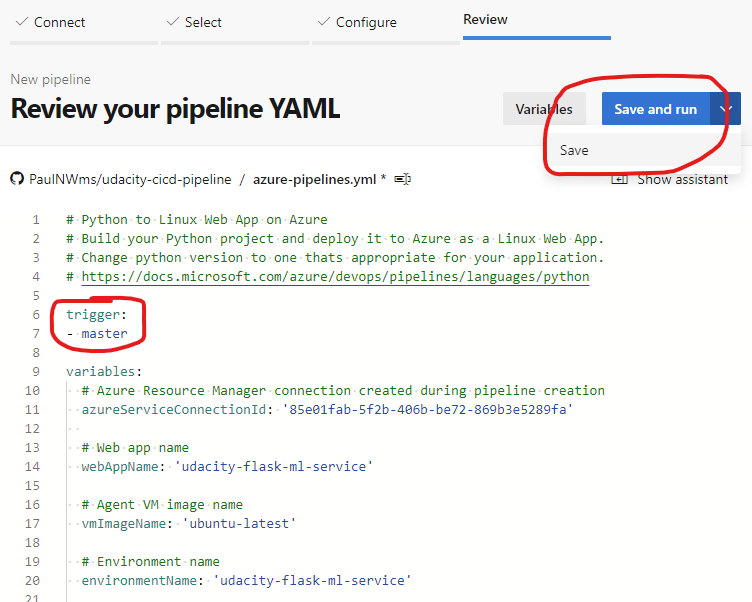
    

**Sanity check and final test:**
Now go back to Settings | Service Connections.  There should be a connection to GitHub, and the connection to the microservice.  
(The wizard also created a third connection... I didn't make the world, I just live here.)
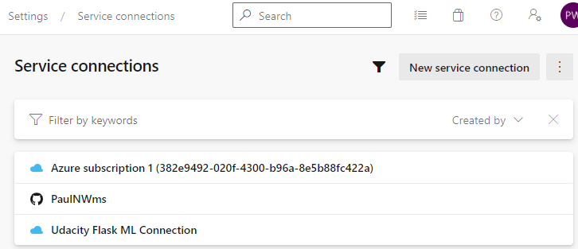

Now we can make a code change and run the pipeline.  In GitHub, open the repo and edit azure-pipelines.yml.  Change the trigger to `main`.

Commit the changes, and the pipeline should start.

The deployment step seems to be somewhat brittle, and you may need to re-run the pipeline for it to succeed.  In this case, the pipeline failed to deploy a couple times, and succeeded on the third attempt.
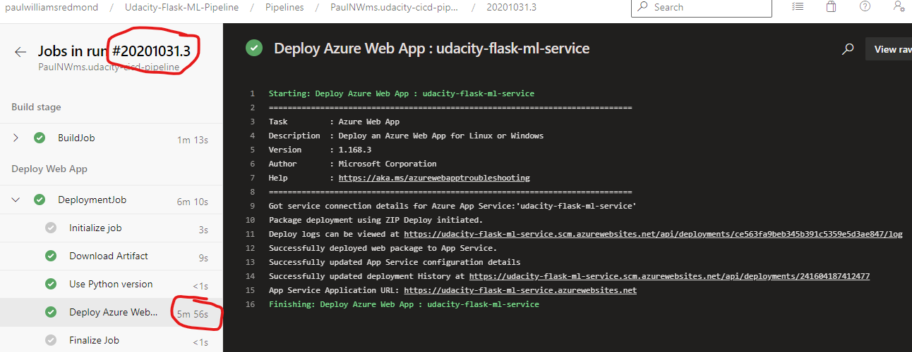

Now go back to the Azure Cloud Shell and check to make sure the microservice actually works.


As a fun bonus, the project contains a locust file `locustfile.py` which you can use to max out the F1 tier VM!

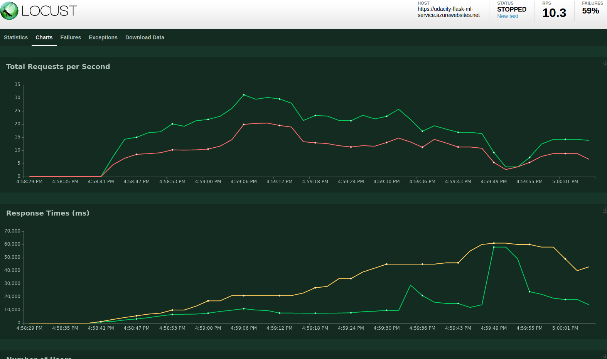

## Enhancements

There a number of ways to improve the project in the future:
- Basic cleanup - remove dead code
- Instead of having the user run through the Azure Pipeline wizard, find a way he can use the existing `azure-pipelines.yml`.
- The main purpose of this assignment (I think) is to demonstrate that we know how to manually create an Azure Pipeline using the web UI.  This UI in turn drives a REST API, which is [documented](https://docs.microsoft.com/en-us/rest/api/azure/devops/build/definitions/create?view=azure-devops-rest-4.1).  In other words, the process could be scripted.
- As target environments come and go, corresponding devops pipelines may want to come and go with them.  To me this seems like an unusual scenario; however, there actually is an [Azure DevOps provider for Terraform](https://techcommunity.microsoft.com/t5/itops-talk-blog/how-to-use-terraform-to-create-azure-devops-projects/ba-p/1555471).  Judging by its version number, it's probably not yet production quality.

## Demo 

And last but not least, here is the [YouTube video](https://youtu.be/Fsn5DOfTtDM).
